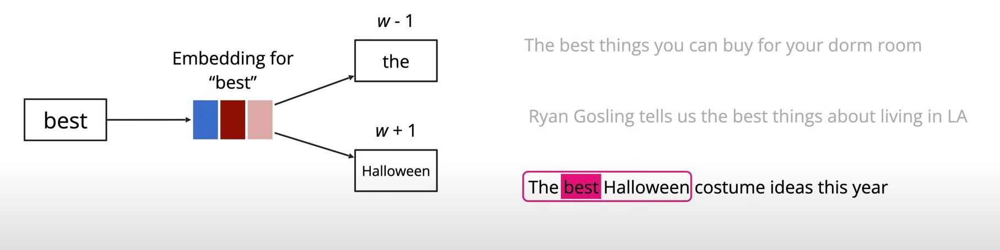

# DeepLearning
System Recomemder


<h2>Streamlit la 1 framework python</h2>


```
python -m pip install streamlit

cd funtion -> npm i or npm install


```


```
Data set in gg colab 

- movies_list.pkl
- dataset_movie.csv
- similarity.pkl

```
- Mô hình này sẽ đào tạo dưa trên : Khi đào tạo nhiều lần nó nhận thấy từ best thường đi với the -> trọng số vector của best và the sẽ lớn -> khi về sau thì best sẽ viết là gần the (hay trọng số lớn) -> và nếu người dùng tìm cái gì có b





Transform tìm từ theo ngữ cảnh


Ví dụ tìm liên quan tới A book about the Roman Empire -> thì nó sẽ so sánh 
kc vector các từ với id 101 ->  104 đã lưu ở csdl của mình vector nào gần với nó nhất (hoặc có động tương đồng cosin (Similarity)) thì nó recommemed


truy cập từ id vào lại obj

